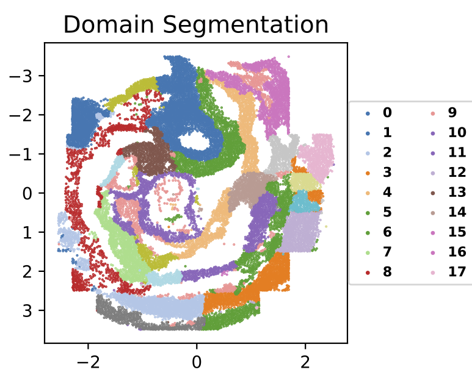
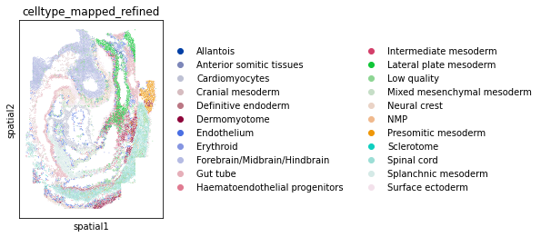
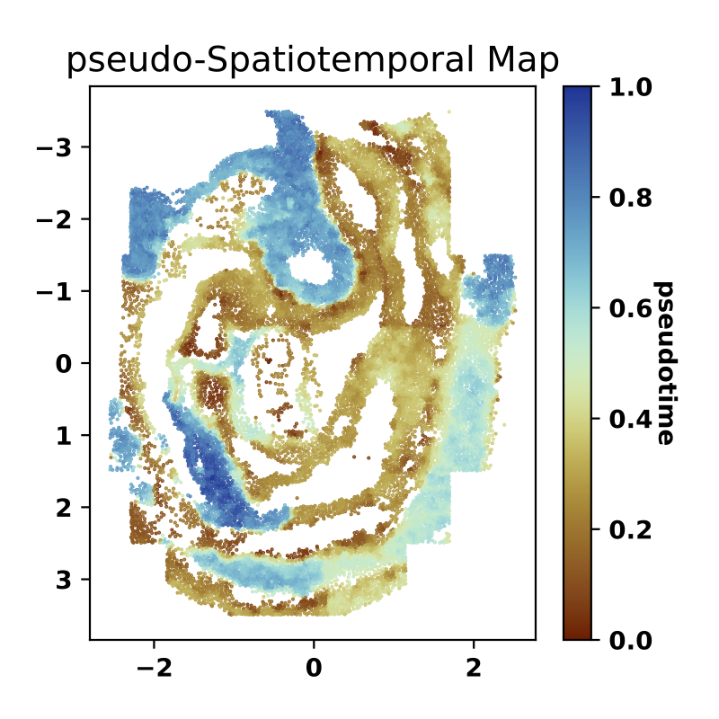

# SpaceFlow: Identifying Multicellular Spatiotemporal Organization of Cells using Spatial Transcriptome Data

SpaceFlow is Python package for identifying spatiotemporal patterns and spatial domains from Spatial Transcriptomic (ST) Data. Based on deep graph network, SpaceFlow provides the following functions:  
1. Encodes the ST data into **low-dimensional embeddings** that reflecting both expression similarity and the spatial proximity of cells in ST data.
2. Incorporates **spatiotemporal** relationships of cells or spots in ST data through a **pseudo-Spatiotemporal Map (pSM)** derived from the embeddings.
3. Identifies **spatial domains** with spatially-coherent expression patterns.

## Installation

### 1. Prepare environment (Optional)
To install SpaceFlow, we recommend using the [Anaconda Python Distribution](https://anaconda.org/) and creating an isolated environment, so that the SpaceFlow and dependencies don't conflict or interfere with other packages or applications. To create the environment, run the following script in command line:

```bash
conda create -n spaceflow_env python=3.7
```

After create the environment, you can activate the `spaceflow_env` environment by:
```bash
conda activate spaceflow_env
```
You can deactivate the `spaceflow_env` environment anytime by:
```bash
conda deactivate
```

### 2. Install Pytorch and dependencies
SpaceFlow depends on several packages, such as: [torch](https://pytorch.org/), [numpy](https://numpy.org/), [scipy](https://scipy.org/), [networkx](https://networkx.org/), etc. See a full list of the dependencies in `requirements.txt` file.

Before install the SpaceFlow, we first need to install `Pytorch` by:

```bash
pip install --user torch==1.9.0 
```

Then, we install other dependencies through:
```bash
pip install --user --requirement requirements.txt
```

### 3. Install SpaceFlow
Switch to the `spatial-constrained-clustering-and-pseudotime` directory of the downloaded SpaceFlow package in command line, and run the following command to install SpaceFlow:
```bash                                          
pip install --user .
```

## Usage

### Quick Start by Example ([Jupyter Notebook](tutorials/seqfish_mouse_embryogenesis.ipynb))

We will use the mouse organogenesis ST data from [(Lohoff, T. et al. 2022)](https://doi.org/10.1038/s41587-021-01006-2) generated by [seqFISH](https://spatial.caltech.edu/seqfish/) to demonstrate the usage of SpaceFlow. 

The data is available in [squidpy](https://squidpy.readthedocs.io/en/stable/) package, so we first import the `squidpy` package and load the data.

#### 1. Import SpaceFlow and squidpy package

```python
import squidpy as sq
from SpaceFlow import SpaceFlow
```

#### 2. Load the ST data from squidpy package
```python
adata = sq.datasets.seqfish()
```

#### 3. Create SpaceFlow Object
We create a SpaceFlow object using the count matrix of gene expression and the corresponding spatial locations of cells (or spots):

```python
sf = SpaceFlow.SpaceFlow(expr_data=adata.X, 
                         spatial_locs=adata.obsm['spatial'])
```
Parameters:
- `expr_data`: the count matrix of gene expression, 2D numpy array of size (# of cells, # of genes)
- `spatial_locs`: spatial locations of cells (or spots) match to rows of the count matrix, 1D numpy array of size (n_locations,)

#### 4. Preprocessing the ST Data
Next, we preprocess the ST data by run: 

```python
sf.preprocessing_data(n_top_genes=3000)
```
Parameters:
- `n_top_genes`: the number of the top highly variable genes.

The preprocessing includes the normalization and log-transformation of the expression count matrix, the selection of highly variable genes, and the construction of spatial proximity graph using spatial coordinates. (Details see the `preprocessing_data` function in `SpaceFlow/SpaceFlow.py`)

#### 5. Train the deep graph network model

We then train a spatially regularized deep graph network model to learn a low-dimensional embedding that reflecting both expression similarity and the spatial proximity of cells in ST data.  

```python
sf.train(spatial_regularization_strength=0.1, 
         z_dim=50, 
         lr=0.001, 
         epochs=1000, 
         max_patience=50, 
         min_stop=100, 
         random_seed=42, 
         gpu=0)
```

Parameters:
- `spatial_regularization_strength`: the strength of spatial regularization, the larger the more of the spatial coherence in the identified spatial domains and spatiotemporal patterns. (default: 0.1)
- `z_dim`: the target size of the learned embedding. (default: 50)
- `lr`: learning rate for optimizing the model. (default: 0.001)
- `epochs`: the max number of the epochs for model training. (default: 1000)
- `max_patience`: the max number of the epoch for waiting the loss decreasing. If loss does not decrease for epochs larger than this threshold, the learning will stop, and the model with the parameters that shows the minimal loss are kept as the best model. (default: 50) 
- `min_stop`: the earliest epoch the learning can stop if no decrease in loss for epochs larger than the `max_patience`. (default: 100) 
- `random_seed`: the random seed set to the random generators of the `random`, `numpy`, `torch` packages. (default: 42)
-  `gpu`: the index of the Nvidia GPU, if no GPU, the model will be trained via CPU, which is slower than the GPU training time. (default: 0) 

#### 6. Domain segmentation of the ST data

After the model training, the learned low-dimensional embedding can be accessed through `sf.embedding`.

SpaceFlow will use this learned embedding to identify the spatial domains based on [Leiden](https://www.nature.com/articles/s41598-019-41695-z) algorithm. 

```python
sf.segmentation(domain_label_save_filepath="./domains.tsv", 
                n_neighbors=50, 
                resolution=1.0)
```
Parameters:

- `domain_label_save_filepath`: the file path for saving the identified domain labels. (default: "./domains.tsv")
- `n_neighbors`: the number of the nearest neighbors for each cell for constructing the graph for Leiden using the embedding as input. (default: 50)
- `resolution`: the resolution of the Leiden clustering, the larger the coarser of the domains. (default: 1.0)

#### 7. Visualization of the annotation and the identified spatial domains

We next plot the spatial domains using the identified domain labels and spatial coordinates of cells.

```python
sf.plot_segmentation(segmentation_figure_save_filepath="./domain_segmentation.pdf", 
                     colormap="tab20", 
                     scatter_sz=1.)
```

The expected output is:



We can also visualize the expert annotation for comparison by:

```python
import scanpy as sc
sc.pl.spatial(adata, color="celltype_mapped_refined", spot_size=0.03)
```

The expected output is:



Parameters:
- `segmentation_figure_save_filepath`: the file path for saving the figure of the spatial domain visualization. (default: "./domain_segmentation.pdf")
- `colormap`: the colormap of the different domains, full colormap options see [matplotlib](https://matplotlib.org/3.5.1/tutorials/colors/colormaps.html)
- `scatter_sz`: the marker size in points. (default: 1.0)

#### 8. Idenfify the spatiotemporal patterns of the ST data through pseudo-Spatiotemporal Map (pSM)

Next, we apply the diffusion pseudotime (dpt) algorithm to the learned spatially-consistent embedding to generate a pseudo-Spatiotemporal Map (pSM). This pSM represents a spatially-coherent pseudotime ordering of cells that encodes biological relationships between cells, such as developmental trajectories and cancer progression

```python
sf.pseudo_Spatiotemporal_Map(pSM_values_save_filepath="./pSM_values.tsv", 
                             n_neighbors=20, 
                             resolution=1.0, 
                             cell_number_threshold_for_subsampling=5000)
```
Parameters:
- `pSM_values_save_filepath` : the file path for saving the inferred pSM values. 
- `n_neighbors`: the number of the nearest neighbors for each cell for constructing the graph for Leiden using the embedding as input. (default: 20)  
- `resolution`: the resolution of the Leiden clustering, the larger the coarser of the domains. (default: 1.0)
- `cell_number_threshold_for_subsampling`: the threshold for the number of cells to subsampling for identifying the root cell. If the cell number is larger than this threshold, a cell population with `cell_number_threshold_for_subsampling` size will be randomly selected to infer the root cell. (default: 5000)

#### 9. Visualization of the identified pseudo-Spatiotemporal Map (pSM)

We next visualize the identified pseudo-Spatiotemporal Map (pSM).

```python
sf.plot_pSM(pSM_figure_save_filepath="./pseudo-Spatiotemporal-Map.pdf", 
            colormap="gist_rainbow", 
            scatter_sz=1.)
```

The expected output is like below: 
 


Parameters:
- `pSM_figure_save_filepath`: the file path for saving the figure of the pSM visualization. (default: "./pseudo-Spatiotemporal-Map.pdf")
- `colormap`:  the colormap of the pSM, full colormap options see [matplotlib](https://matplotlib.org/3.5.1/tutorials/colors/colormaps.html)
-  `scatter_sz`: the marker size in points. (default: 1.0)   

## Contact
If you have any questions or found any issues, please contact: [hongleir@uci.edu](mailto:hongleir@uci.edu).